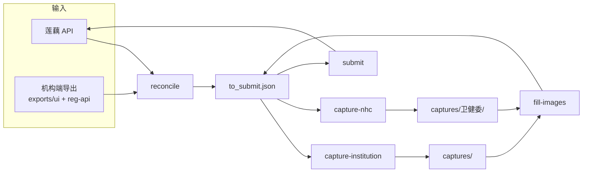

# 医生数据采集与补全（Doctor Data Capture & Completion）

本仓库用于**医生执业相关数据的采集、核对与补全**：从莲藕内部系统拉取我方管理的医生名单及缺失字段，与机构端注册导出核对，补全可映射的文字字段，采集机构端与卫健委公示截图，最终写回莲藕。

**CLI 入口**：`python -m src.cli <子命令>`（默认读取项目根目录 `config.json`）

---

## 快速开始

### 1. 环境准备

```powershell
# 克隆后进入项目目录
cd doctor-detail-screenshot-capture

# 创建并激活虚拟环境（Windows）
python -m venv .venv
.\.venv\Scripts\Activate.ps1

# 安装核心依赖
pip install -e .

# 机构端详情采图额外依赖（仅 capture-institution 需要）
pip install -e ".[capture-institution]"

# 卫健委采图额外依赖（仅 capture-nhc 需要）
pip install -e ".[capture-nhc]"
playwright install chromium
```

机构端 UI 采图依赖 **PowerShell** 与医师电子化注册信息系统（机构版）桌面客户端；首次使用前需完成坐标校准（见下文「机构端 UI 自动化」）。

### 2. 配置文件

复制 `config.json.example` 为 `config.json`，至少配置：

| 配置块 | 用途 |
|--------|------|
| `loginUser` / `loginPassword` | 机构端客户端登录 |
| `doctorApi` | 莲藕 `GetDoctorMedicalPage` 接口（baseUrl、签名等） |
| `minkeRegApi` | 机构端 SOAP 导出（`export-reg`） |
| `names` / `namesMulti` | 机构端 UI 采图时的医生列表（含姓名、身份证；采图命名以执业证书编号为准） |
| `loginCalibration` / `listCalibration` | 机构端 UI 自动化坐标（`calibrate` 生成） |

`config.json` 含账号密码，**勿提交到 Git**。

### 3. 典型工作流

**完整链路（推荐分步执行，便于在中途检查结果）：**

```powershell
# ① 拉取机构端最新名单（SOAP，可选；也可手动 UI 导出到 exports/ui/）
python -m src.cli export-reg

# ② 核对：莲藕 × 机构端 → 生成提交计划
python -m src.cli reconcile

# ③ 采图（需机构端客户端 / 浏览器环境就绪）
python -m src.cli capture-institution
python -m src.cli capture-nhc

# ④ 截图转 base64 写回 to_submit.json
python -m src.cli fill-images

# ⑤ 写回莲藕（默认 dry-run，确认后再 --commit）
python -m src.cli submit
python -m src.cli submit --commit # 仅文字字段
python -m src.cli submit --commit --include-images # 含图片
```

**只跑到采图前（核对 + 导出，不启动采图）：**

```powershell
python -m src.cli export-reg
python -m src.cli reconcile
# 检查 workspace/artifacts/reconcile_report.xlsx 与 to_submit.json
```

**一键串跑：**

| 命令 | 说明 |
|------|------|
| `run-all` | 从 `reconcile` 起：采图 → fill-images → submit |
| `run-all --with-export` | 先 `export-reg`，再核对与后续 |
| `run-all --skip-capture` | 跳过采图，仅核对后 submit |
| `run-all --skip-submit` | 核对 + 采图 + 回填，不提交 |
| `run-all --commit` | submit / fill-images 真调接口 |

---

## 项目结构

```
doctor-detail-screenshot-capture/
├── AGENTS.md # 本文件：项目说明与 Agent 指南
├── config.json # 本地配置（勿提交）
├── config.json.example
├── src/ # Python 源码
│ ├── cli/ # CLI 入口与子命令
│ ├── api/ # 莲藕 API 拉取
│ ├── minke_reg/ # 机构端 SOAP 导出（含 practice_table.py 独立明细流程）
│ ├── institution_export/# 导出文件解析与索引
│ ├── reconcile/ # 核对、to_submit 生成、写回载荷
│ ├── capture/ # 采图编排（机构端 Python / 卫健委 Playwright）
│ │ └── institution/ # 机构端详情采图（Python 重写，10 模块）
│ └── lianou/ # UpdateDoctorMedical 写回
├── automation/
│ ├── ps1/ # 机构端 UI 自动化（export/export-calibrate/verify-captures 用 PS1）
│ └── py/ # OCR 校验等
├── cmd/ # 薄封装 .cmd（automation / reg-api / api）
├── exports/ # 机构端导出输入
│ ├── reg-api/ # SOAP 自动导出（.xlsx）
│ └── ui/ # 客户端 UI 手动导出（.xls）
├── workspace/ # 管线工作区
│ ├── artifacts/ # 核对主产物（to_submit、报告、摘要）
│ ├── cache/ # 莲藕 API 24h 缓存
│ ├── debug/ # --debug 中间快照
│ └── tmp/ # 采图临时配置；后台长任务日志/状态（如 build-practice-hospital-report.*）
├── captures/ # 截图输出（机构端 + 卫健委）
└── docs/adr/ # 架构决策记录
```

---

## 管线流程



### 分步骤命令

| 步骤 | 命令 | 作用 | 主要产出 |
|------|------|------|----------|
| 0（可选） | `export-reg` | SOAP 拉最新主/多执业名单 | `exports/reg-api/主执业导出-*.xlsx`、`多执业导出-*.xlsx` |
| 1（可选） | `fetch` | 单独拉莲藕全量医生 | `workspace/cache/doctors_api_cache.json` |
| 2（可选） | `parse-exports` | 单独解析导出建索引 | 控制台统计；`--debug` 时 `debug/export_index.json` |
| 3 | **`reconcile`** | 莲藕 × 机构端核对 | `artifacts/to_submit.json`、`reconcile_report.xlsx`、`reconcile_summary.json` |
| 4 | `capture-institution` | 机构端采详情图 | `captures/主执业|多执业/` |
| 5 | `capture-nhc` | 卫健委公示站采图 | `captures/卫健委/` |
| 6 | `fill-images` | 截图 base64 写回 JSON | 更新后的 `to_submit.json` |
| 7 | `submit` | 写回莲藕 UpdateDoctorMedical | 接口响应日志 |

`reconcile` 自动复用 24h 莲藕缓存，并在 `exports/ui/` 与 `exports/reg-api/` 各取**修改时间最新**的主/多执业导出，通常无需单独 `fetch` / `parse-exports`。

### 安全默认（dry-run）

| 命令 | 默认行为 | 真执行 |
|------|----------|--------|
| `submit` | 打印将提交的内容 | `--commit` |
| `fill-images` | 只写回 JSON | `--commit` |
| `capture-*` | 真采图 | `--dry-run` 仅预览目标数 |

### 可拆开执行

- **仅文字字段**：`reconcile` 后 `submit --commit`；更新时空图片字段不会提交。
- **含图片**：须 `capture-*` → `fill-images` → `submit --commit --include-images`。

---

## 独立流程：医生执业医院明细表（`fetch-practice-table`）

这是一条**与核对/采图/写回主线完全独立**的流程，不读取 `to_submit.json`、不写回莲藕、不依赖 UI 自动化坐标。仅通过机构端 SOAP 接口汇总每个医生在所有省份的主执业 + 多执业备案信息，输出 Excel 明细表。**不含电子证照**（电子证照已拆为独立命令 `check-elec-license`，见下节）。

### 用途

- 一次性盘点某医生（或一批医生）在**所有省份**的执业注册全景
- 取得主执业审批日期、多执业备案起止日期、医院地址等字段
- 不属于"补全缺失字段并写回莲藕"的主线，仅用于人工核查 / 留档

### 数据来源（全 SOAP，无 UI）

| 接口 | 作用 |
|------|------|
| `DoctorUnitGetListForOther` (st=1/8/9/10/11) | 取注册行：本院主执业、外院在本院多执业、本院多机构备案、本院医生外省主执业/多执业 |
| `GetRegDetailForUnit` | 取注册行详情：审批日期、医院地址、省份（一次调用解析全字段） |
| `GetMutiRegListByRegisterId` | 取每个注册行下属的多执业备案（含起止日期） |

### 性能

**两档执行模式：**

- **串行模式**（默认，小批量）：跨医生共享全量列表缓存，5 个 `searchType` 全量列表只拉一次，后续医生从内存 filter；`GetRegDetailForUnit` 一次调用解析全字段。实测：单医生 ~22s，批量 5 名 ~40s（平均 ~8s/医生）。
- **并行模式**（`--all` / `--parallel`，全量/大批量推荐）：列表只拉 1 次 → **并行预取**全部 `GetRegDetailForUnit` + `GetMutiRegListByRegisterId`（线程安全缓存）→ 纯内存组装写表。线程数默认按 CPU 核数×2 推算、封顶 32（可用 `--workers` 或 `config.practiceTableWorkers` 覆盖）。实测：批量 10 名 ~23s（串行 48s），全量 3459 名 ~4.5 分钟 / 14524 行（detail×11730 + muti×8596）。

### 医生筛选口径

- 指定姓名：`fetch-practice-table 艾勇 白广同 ...`
- 自动取名单：`--batch N`，从主执业在本院（st=1）∪ 多执业含本院（st=8）**交替**取前 N 名（去重），保证两类都覆盖
- 全量名单：`--all`，st=1∪st=8 全部去重姓名（自动启用并行模式）

对每个入选医生，拿全其在所有省份的主执业 + 多执业备案；多执业备案行按「姓名+执业医院+开始日期+结束日期」全局去重，避免 st=8/9 列表行与 `GetMutiRegListByRegisterId` 返回行重复。

### 命令

```powershell
# 单个医生
python -m src.cli fetch-practice-table 艾勇

# 多个医生，指定输出
python -m src.cli fetch-practice-table 艾勇 白广同 --output workspace/artifacts/xxx.xlsx

# 自动取 10 名（主执业+多执业交替）
python -m src.cli fetch-practice-table --batch 10

# 全量名单（st=1∪st=8 全部，并行预取，推荐）
python -m src.cli fetch-practice-table --all

# 指定输出
python -m src.cli fetch-practice-table --all --output workspace/artifacts/医生执业医院.xlsx

# 指定线程数（默认按 CPU 推算、封顶 32）
python -m src.cli fetch-practice-table --all --workers 16
```

> `--all` 与 `--parallel` 自动启用并行预取；小批量默认串行，加 `--parallel` 也可强制并行。

### 产出

`workspace/artifacts/医生执业医院.xlsx`（默认命名：单医生 `医生执业医院_艾勇.xlsx`；多人/全量 `医生执业医院.xlsx`，可用 `--output` 覆盖）。

列：姓名、身份证号、**执业证书编码**、性别、医师类别、医师级别、执业范围、任职资格、审批日期、开始日期、结束日期、是否主执业机构、是否省外、执业医院、医院地址、省份、数据来源。

### 容错

会话失效（"非法的用户身份"）时自动重新登录、清空列表缓存重新预拉，并重试当前医生一次。

### 依赖

`openpyxl`（写 xlsx），在 `capture-institution` extra 内；单独使用须 `pip install openpyxl`。

---

## 独立流程：医生执业医院信息报告（`build-practice-hospital-report`）

在 `fetch-practice-table` 产出的机构端明细基础上，**实时请求**莲藕 `GetDoctorMedicalPage`（**不读** `workspace/cache/doctors_api_cache.json`），按执业证书编码 join 档案三列，生成四 sheet 汇总报告。

### 数据来源

| 来源 | 作用 |
|------|------|
| 机构端 SOAP（`fetch-practice-table --all` 或本命令内置拉取） | 全量明细行（含执业证书编码） |
| 莲藕 API `fetch_all_records` | 档案编号 / 档案状态 / 所属团队 |
| 模板 `医生执业医院信息.xlsx` | 保留「互联网医院重叠数」名单（A–G 列），重算 H 列及另外三 sheet |

**禁止**使用 `practice_hospitals_all_fixed.xlsx` 作为输入。

### 产出

默认 `workspace/artifacts/医生执业医院信息_20260706.xlsx`（四 sheet：全量明细、医生执业医院数、互联网医院重叠数、医院重叠数）。

### 执行方式（Agent 必读）

本命令全量约 **15–25 分钟**，超过 Cursor Agent Shell 等待上限（约 15 分钟）。**Agent 执行时必须用方式 2**，禁止方式 3。

| 方式 | 适用 | 做法 |
|------|------|------|
| **1. 集成终端** | 用户本人操作 | 在 Cursor 底部终端手动跑前台命令，进度可见 |
| **2. Agent 前台 Shell** | ❌ 禁止 | 易超时中断，长任务请走方式 1 |

```powershell
# 用户本人在集成终端跑
python -m src.cli build-practice-hospital-report

# 已有机构端明细时跳过 SOAP
python -m src.cli build-practice-hospital-report --skip-institution-fetch
```

**禁止：** Agent 用前台 Shell 跑完整 `build-practice-hospital-report`（约 15–25 分钟，易超时中断）。

### 依赖

`openpyxl`（与 `fetch-practice-table` 相同）。

---

## 独立流程：电子证照（`check-elec-license`）

与执业医院明细流程**解耦**的独立命令，只生成电子证照预览 URL 并检测申领状态，不拉详情、不拉多执业备案。

### 数据来源

| 来源 | 作用 |
|------|------|
| `DoctorUnitGetListForOther` (st=1/8) | 按姓名定位 `Doctor_GID` / `Doctor_RegisterGID`（优先主执业 st=1，其次多执业含本院 st=8） |
| `make_electronic_license_url`（本地 AES-128-CBC） | 用 GID 拼对生成 `https://license.wsb003.cn/license/doctor?ty=d&encry=...&f=D_U` |
| HTTP GET 该 URL + 解析 `<title>` | title 含 `--` 与 `信息展示` 视为「已申领」，否则「未申领」；按 URL 缓存结果 |

### 命令

```powershell
python -m src.cli check-elec-license 艾勇 白广同
python -m src.cli check-elec-license 艾勇 --output workspace/artifacts/elec.xlsx
```

### 产出

`workspace/artifacts/elec_license_*.xlsx`（单医生 `elec_license_艾勇.xlsx`；批量 `elec_license_batchN.xlsx`）。

列：姓名、身份证号、医师类别、医师级别、执业范围、查看电子证照、是否已申领电子证照。未在 st=1/st=8 列表中找到的医生，"是否已申领电子证照"填「未找到该医生」。

### 依赖

`pycryptodome`（AES），在 `capture-institution` extra 内；单独使用须 `pip install pycryptodome`。

---

## 机构端 UI 自动化

**详情采图与坐标校准已用 Python 重写**（`src/capture/institution/`），解决 ESC 暂停失效、前台检测失效、孤儿进程三个根本问题；OCR 直接调用 `rapidocr_onnxruntime`，暂停控制全用 `ctypes` 不依赖控制台。

**导出 / 验证仍用 PS1**：`automation/ps1/capture-doctor-details.ps1` 的 `Export` / `ExportCalibrate` / `verify-captures` 等模式仍由 `run-automation` 调用（`calibrate` 已改为 Python，生成的 `loginCalibration` / `listCalibration` 坐标供 Python 采图使用）。

```powershell
# 校准登录与列表坐标（首次必做，Python）
python -m src.cli run-automation calibrate

# UI 手动导出名单到 exports/ui/（PS1）
python -m src.cli run-automation export --entry Main
python -m src.cli run-automation export --entry Multi

# 机构端详情采图（Python，也可由 capture-institution 根据 to_submit 自动驱动）
python -m src.cli run-automation capture --entry Main

# OCR 校验已有截图（PS1）
python -m src.cli run-automation verify-captures
```

`capture-institution` 读取 `to_submit.json` 中的 `_capture` 元数据，按主/多执业分组后直接调用 `src.capture.institution.runner.run_capture_session`（不再生成临时配置、不再起 PS1 子进程）。

**Python 采图模块**（`src/capture/institution/`）：

| 模块 | 职责 |
|------|------|
| `win32_api.py` | ctypes 封装 Win32 API（鼠标/键盘/前台/最大化/IME） |
| `windows.py` | uiautomation 窗口查找 + win32 前台/最大化 |
| `input.py` | 点击/双击/粘贴/IME/SendInput 键盘/Alt+F4 |
| `screenshot.py` | PIL 截图 + SHA256 哈希 + 稳定检测 |
| `ocr.py` | RapidOCR 直接调用 + 证书号提取正则 |
| `pause.py` | PauseController（ESC 边沿 + 前台检测，全 ctypes） |
| `error_popup.py` | 接口异常弹窗检测 + 自动重启 |
| `login.py` | 登录流程 + 进列表导航 |
| `capture.py` | 核心采图循环（搜索→双击→截图→OCR→保存） |
| `runner.py` | 编排器 `run_capture_session` |

**暂停/恢复**：运行中按 `ESC` 暂停/恢复（边沿触发，避免长按重复切换）；机构端窗口失去前台时自动暂停，切回前台后需再按 `ESC` 才继续。

**依赖**：`pip install -e ".[capture-institution]"` 或 `pip install -r requirements/capture-institution.txt`。

---

## 术语与命名（Language）

编写代码、文档与用户沟通时请统一用词。

### 数据来源

| 术语 | 含义 | 避免使用 |
|------|------|----------|
| **莲藕系统** | 我方内部业务系统（imax，`GetDoctorMedicalPage`）；名单与缺失字段的权威来源，也是写回目标 | 系统、内部系统、imax（除接口实现外） |
| **机构端** | 医师电子化注册信息系统（机构版）客户端及导出；审核日期、执业范围等注册信息权威来源 | 民科、实际系统、注册库 |
| **主执业导出 / 多执业导出** | 机构端两张互斥名单文件。主执业含「审核日期」；多执业含「开始/结束日期」 | 第一执业表、多点执业表 |
| **第一执业 / 多点执业** | 执业类型，对应 `medicalInstitutionType`（1/2）；由匹配到的导出表推断，非查表输入 | 用「主执业/多执业」指类型（那两词专指文件） |
| **卫健委** | 国家卫健委公示平台（`zgcx.nhc.gov.cn`） | 公示平台、国网 |

### 核对与中间数据

**核对**：以莲藕为基准，`doctorName` + `practicingCertCode` 与导出「姓名」+「执业证书编码」**双字段同时匹配**。禁止仅用姓名；证书号为空 → 莲藕有机构端无。

**to_submit.json**（`workspace/artifacts/`）：双匹配成功后，**仅针对「莲藕健康医院」** 生成的 **UpdateDoctorMedical 操作体数组**（其它 `docMedicalList` 医院不生成提交项）。

- **顶层**：`operationType`、`aId`（更新时）、身份五件套（`doctorFileId` / `doctorName` / `iDCard` / `qualificationCertCode` / `practicingCertCode`）
- **`updateField`**：本次实际要提交的业务字段（科室、日期、图片 base64 等）
- **`_capture` / `_op`**：采图定位用，**不提交**接口

生成规则：
- docMedicalList **缺「莲藕健康医院」** → `operationType=0` 新增
- docMedicalList **仅有「莲藕健康医院」**且其 `updateField` 非空 → `operationType=1` 更新；图片字段空字符串表示待采图
- **其它医院**（即使有点名缺失字段）→ **不写入** `to_submit.json`，`submit` / `fill-images` 亦跳过
- 提交时 `postable_body` 展平顶层与 `updateField`；更新丢弃空值，新增保留空占位

**莲藕健康医院**：本院在 docMedicalList 中的固定医院名。

**未匹配名单**（`workspace/artifacts/reconcile_report.xlsx`，每次覆盖）：
- sheet `莲藕有机构端无`：双字段无法匹配（含无证书号、导出无此证、姓名不一致）
- sheet `机构端有莲藕无`：导出有、莲藕无对应证书号

### 工作区产物

**主产物（`workspace/artifacts/`，每次 reconcile 覆盖）：**

| 文件 | 说明 |
|------|------|
| `to_submit.json` | 提交操作体；采图、回填、提交均读此文件 |
| `reconcile_report.xlsx` | 未匹配名单 |
| `reconcile_summary.json` | 条数统计与导出来源 |

**其它子目录：**

| 路径 | 说明 |
|------|------|
| `cache/doctors_api_cache.json` | 莲藕 API 全量缓存（24h） |
| `debug/` | 仅 `--debug`：`doctors.json`、`export_index.json`、`reconcile_result.json` |
| `tmp/capture-config-*.json` | 机构端采图临时配置 |
| `tmp/nhc-failures.log` | 卫健委采图失败日志 |

**机构端导出（`exports/`）：**

| 目录 | 来源 | 格式 |
|------|------|------|
| `exports/ui/` | 客户端 UI 手动导出 | 多为 `.xls` |
| `exports/reg-api/` | `export-reg` SOAP 导出 | `.xlsx` |

**截图（`captures/`）：**

| 类型 | 路径 | 莲藕字段 | 命名 |
|------|------|----------|------|
| 机构端 | `captures/主执业\|多执业/` | `institutionBase` | `姓名_执业证书编号.png` |
| 卫健委 | `captures/卫健委/` | `healthCommissionBase` | 同上规则 |

OCR 与校验均按**执业证书编号**，非身份证。

---

## 字段映射（机构端导出 → 莲藕）

匹配与写回**不以身份证为键**；身份证仅用于报告展示与采图定位。

| 用途 | 莲藕 | 机构端导出 |
|------|------|------------|
| 匹配 | `doctorName` + `practicingCertCode` | 「姓名」+「执业证书编码」 |
| 科室 | `professionalList` | 「执业范围」（`,`/`，` → `;`）+「医师类别」→`professionalType` |
| 主执业备案日 | `recordDate` | 「审核日期」 |
| 多执业起止 | `recordDate` / `recordExpireDate` | 「开始日期」/「结束日期」 |
| 执业类型 | `medicalInstitutionType` | 主=1，多=2（由匹配表推断） |
| 省/市/等级 | `practiceProvince` / `practiceCity` / `hospitalLevel` | 默认：广东省、广州市、`10`（二级） |
| 图片 | `institutionBase` / `healthCommissionBase` | 采图脚本生成 base64 |

身份五件套来自莲藕 API，不由机构端导出补写。

---

## Agent 开发须知

1. **路径**：主产物统一在 `workspace/artifacts/`，通过 `src/pipeline/paths.py` 引用，勿硬编码旧根路径。
2. **匹配**：必须证书号 + 姓名双字段；勿改为仅姓名或仅身份证匹配。
3. **写回**：`submit` / `fill-images` 默认 dry-run；改 `--commit` 行为需谨慎。
4. **配置**：不修改、不提交 `config.json`；示例用 `config.json.example`。
5. **采图**：机构端依赖 Windows 桌面客户端与 PS1；卫健委依赖 Playwright，勿在无头环境强行跑 UI 步骤。
6. **最小改动**：沿用现有 CLI 子命令与目录约定；新功能优先扩展 `src/cli/pipeline_cmds.py` 与对应模块。
7. **危险操作**：脚本中**禁止**对项目根目录、`workspace/`、`captures/` 使用 `Remove-Item -Recurse -Force`；任何清理操作必须显式指定文件名/扩展名，禁止用通配符兜底。变量为空时 `Remove-Item "$x\*"` 等价于删除当前目录全部内容。
8. **长任务（Agent）**：预计 **>10 分钟** 或含全量 SOAP/API 的命令（如 `build-practice-hospital-report`、`fetch-practice-table --all`），**Agent 禁止用前台 Shell 跑**（易超时中断）；请提示用户在 Cursor 集成终端手动执行。详见上文「医生执业医院信息报告 → 执行方式」。

---

## 相关文档

- 接口字段：[`医生医疗机构接口文档.md`](医生医疗机构接口文档.md)
- 架构决策（`docs/adr/`）：
  - [`0001-updatefield-driven-completion-pipeline.md`](docs/adr/0001-updatefield-driven-completion-pipeline.md) — 以莲藕 `updateField` 驱动的单向补全管线
  - [`0002-retain-powershell-capture.md`](docs/adr/0002-retain-powershell-capture.md) — 统一 Python CLI，保留 PS1 截图脚本（详情采图已用 Python 重写，导出/验证仍用 PS1）
  - [`0003-main-practice-record-date-from-review-date.md`](docs/adr/0003-main-practice-record-date-from-review-date.md) — 主执业备案日期取自审核日期
  - [`0004-field-mapping-rules.md`](docs/adr/0004-field-mapping-rules.md) — 机构端导出列到莲藕字段的映射规则
  - [`0005-merge-batch-doctor-query.md`](docs/adr/0005-merge-batch-doctor-query.md) — 卫健委采集并入主项目
  - [`0006-writeback-via-update-doctor-medical.md`](docs/adr/0006-writeback-via-update-doctor-medical.md) — 写回经 UpdateDoctorMedical 单条更新
  - [`0007-strict-match-and-slim-artifacts.md`](docs/adr/0007-strict-match-and-slim-artifacts.md) — 严格双字段匹配与精简 reconcile 产物（匹配规则部分被 0008 取代）
  - [`0008-cert-match-docmedical-operationtype.md`](docs/adr/0008-cert-match-docmedical-operationtype.md) — 证书号 + 姓名双字段匹配，operationType 由 docMedicalList 推断
