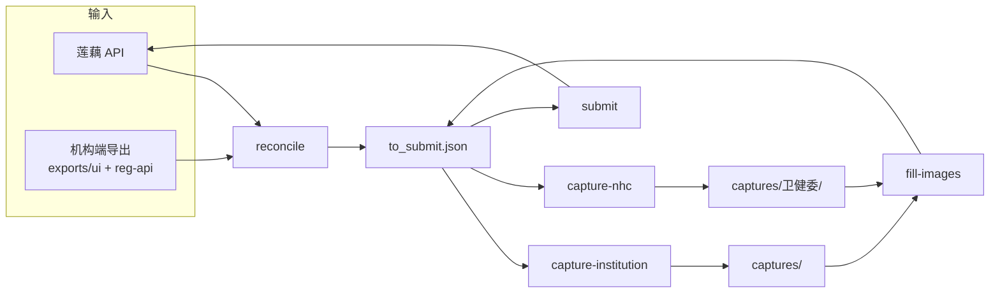

# 医生数据采集与补全（Doctor Data Capture & Completion）

本项目围绕"医生执业相关数据的采集、核对与补全"展开：从内部业务系统拉取我方管理的医生名单及其缺失字段，与机构端注册数据核对，补全可补的字段，并采集机构端与卫健委两类公示截图。

## Language

### 数据来源（Data Sources）

**莲藕系统**：
我方内部业务系统（imax，`GetDoctorMedicalPage` 接口）。是"我方管理哪些医生、各医生缺哪些字段"的权威来源，也是需要被补全/写回的目标系统。
_Avoid_: 系统（单独使用时含义不清）、内部系统、imax（仅在指接口实现时使用）

**机构端**：
医师电子化注册信息系统（机构版）桌面客户端及其导出数据。是"审核日期、开始/结束日期、执业范围"等注册信息的权威来源。其导出名单用于与莲藕系统名单核对。
_Avoid_: 民科、实际系统、注册库

**主执业导出 / 多执业导出**：
机构端导出的两张名单。主执业导出含"审核日期"，无开始/结束日期；多执业导出含"开始日期/结束日期"，无审核日期。**一个医生只会出现在其中一张**（两张互斥）。
_Avoid_: 第一执业表、多点执业表（指文件时统一用此二名）

**第一执业 / 多点执业**：
医生执业类型，对应莲藕字段 `medicalInstitutionType`（1 / 2）。本项目中该类型由"医生在主执业还是多执业导出里被匹配到"确定，而非作为查表的输入。
_Avoid_: 主执业/多执业（这两个词专指上面的导出文件，不指类型）

**卫健委**：
国家卫健委医师执业注册信息公示平台（`zgcx.nhc.gov.cn`）。公开查询平台，用于采集卫健委公示截图。
_Avoid_: 公示平台、国网

### 核对与名单（Reconciliation & Rosters）

**核对（对比）**：
以莲藕系统名单为基准，用莲藕的 `doctorName` + `practicingCertCode`（执业证书编号）与机构端导出的「姓名」+「执业证书编码」**双字段同时匹配**。莲藕无 `practicingCertCode`、导出无该证书号、或姓名与导出不一致 → **莲藕有机构端无**核对名单。双匹配成功 → 按 `docMedicalList` 逐医院生成 **to_submit.json** 操作体。机构端导出有而莲藕没有对应证书号 → **机构端有莲藕无**核对名单（仅统计，不新增整名医生）。禁止仅用姓名匹配，证书号为空一律进莲藕有机构端无名单。
_Avoid_: 比对、匹配

**中间数据（to_submit.json）**：
核对后对每个「双匹配成功」的医生，遍历其 `docMedicalList` 生成 **UpdateDoctorMedical 操作体数组**（非查询接口原始结构）。每项结构：

- **顶层（身份 + 控制）**：`operationType`、`aId`（更新时）、身份五件套（`doctorFileId` / `doctorName` / `iDCard` / `qualificationCertCode` / `practicingCertCode`）。
- **`updateField`（对象层）**：本次**实际要提交**的业务字段键值对（科室、日期、图片 base64 等）。来源于莲藕查询接口对该医院点名的缺失字段 + 机构端导出可映射的值；**不是**把查询接口的 `docMedicalList` 数组原样搬过来。
- **`_capture` / `_op`（本地辅助）**：供采图脚本定位医生（身份证、证书号、主/多执业列表）；**不提交**莲藕接口。

生成规则：
- docMedicalList 中**缺「莲藕健康医院」** → 一条 **新增**（`operationType=0`），`updateField` 带齐新增所需业务字段（机构类型、省/市、等级、医院名、科室、日期、图片空占位）。
- docMedicalList 中**每个已存在医院**（含莲藕健康医院）若查询接口 `updateField` 非空 → 一条 **更新**（`operationType=1`，带 `aId`），`updateField` 仅含点名且我方可提供的字段；图片字段空字符串占位表示「待采图」。
- 提交时 `postable_body` 将顶层身份字段与 `updateField` **展平**为接口 JSON；**更新操作**丢弃 `updateField` 内空值，**新增操作**保留空占位字段。

示例（更新）：

```json
{
  "operationType": 1,
  "aId": 11818,
  "doctorFileId": "...",
  "doctorName": "陈丽平",
  "iDCard": "...",
  "qualificationCertCode": "...",
  "practicingCertCode": "...",
  "updateField": {
    "departmentName": "妇产科专业;全科医学专业",
    "institutionBase": ""
  },
  "_capture": {
    "idCard": "...",
    "certCode": "...",
    "listEntry": "Main",
    "hospital": "莲藕健康医院"
  },
  "_op": "update"
}
```

**莲藕健康医院**：
本院在 `docMedicalList` 中的医院名（固定字符串 `莲藕健康医院`）。每位我方管理的医生都应有一条本院记录，缺则新增、有则按其 `updateField` 更新。

**未匹配名单**（合并为单文件 `workspace/reconcile_report.xlsx`，每次核对覆盖）：
一个 xlsx、两个 sheet，**三列：姓名、执业证书编号、身份证**（身份证**展示**优先莲藕 API `idCard`，为空时用机构端导出「身份证号」补充，不参与匹配）：
- sheet `莲藕有机构端无`：莲藕 API 有该医生，但机构端导出无法按「执业证书编号+姓名」双字段匹配（含证书号为空、导出无此证号、姓名不一致）。
- sheet `机构端有莲藕无`：机构端导出有该医生，但莲藕 API 无对应执业证书编号。

**管线中间产物（`workspace/`）**：
每次 `reconcile` 默认只落 **3 个主文件**（固定名、覆盖写）：
| 文件 | 说明 |
|------|------|
| `to_submit.json` | 提交操作体（新增/修改），后续采图、回填、提交均读此文件 |
| `reconcile_report.xlsx` | 核对名单（上表两个 sheet） |
| `reconcile_summary.json` | 核对摘要（条数统计、导出来源路径） |

子目录（不 clutter 根目录）：
| 路径 | 说明 |
|------|------|
| `cache/doctors_api_cache.json` | 莲藕 API 全量缓存（24h 复用） |
| `tmp/capture-config-*.json` | 机构端采图临时配置 |
| `tmp/nhc-failures.log` | 卫健委采图失败日志 |
| `debug/` | 仅 `--debug`：`doctors.json`、`export_index.json`、`reconcile_result.json` |

机构端导出按来源分子目录（均在 `exports/` 下）：

| 目录 | 来源 | 格式 |
|------|------|------|
| `exports/ui/` | 机构端客户端 UI 手动导出 | 多为 `.xls`（OOXML） |
| `exports/reg-api/` | SOAP 接口 `export-reg` 自动导出 | `.xlsx` |

`reconcile` 在两目录中按 `主执业导出-*` / `多执业导出-*` 各取**修改时间最新**的一份（主/多执业独立选取）。截图在 `captures/`。

**缺失字段**：
莲藕系统接口为每位医生返回的、标记其缺少哪些数据的字段（接口字段 `updateField`）。指示该医生需要补全什么。
_Avoid_: updateField（仅指接口字段实现时使用）

### 采集产物（Capture Artifacts）

**机构端图片**：
从机构端客户端详情窗采集的执业信息截图。对应莲藕系统的 `institutionBase`（机构端图片 base64）字段。截图命名：`captures/主执业|多执业/姓名_执业证书编号.png`；OCR 匹配与校验均按**执业证书编号**（非身份证）。
_Avoid_: captures、详情截图

**卫健委图片**：
从卫健委公示平台采集的医师信息截图，与机构端图片同存于 `captures/` 下（`captures/卫健委/`）。对应莲藕系统的 `healthCommissionBase`（卫健委图片 base64）字段。
_Avoid_: screenshots、batch-doctor-query

---

## 管线流程（Pipeline）

从莲藕拉名单、与机构端导出核对、采图、写回莲藕的完整链路如下。入口：`python -m src.cli <子命令>`（配置文件默认 `config.json`）。



### 分步骤命令

| 步骤 | 命令 | 作用 | 主要产出 |
|------|------|------|----------|
| 0（可选） | `export-reg` | 调机构端 SOAP 拉最新主/多执业名单 | `exports/reg-api/主执业导出-*.xlsx`、`多执业导出-*.xlsx` |
| 1（可选） | `fetch` | 单独拉莲藕全量医生 | `workspace/cache/doctors_api_cache.json` |
| 2（可选） | `parse-exports` | 单独解析导出建索引 | 控制台统计；`--debug` 时 `debug/export_index.json` |
| 3 | **`reconcile`** | 莲藕 × 机构端核对，生成提交计划 | `to_submit.json`、`reconcile_report.xlsx`、`reconcile_summary.json` |
| 4 | `capture-institution` | 机构端客户端采详情图（补 `institutionBase`） | `captures/` |
| 5 | `capture-nhc` | 卫健委公示站采图（补 `healthCommissionBase`） | `captures/卫健委/` |
| 6 | `fill-images` | 截图转 base64 写回 `to_submit.json` | 更新后的 `to_submit.json` |
| 7 | `submit` | 调用 `UpdateDoctorMedical` 写回莲藕 | 接口响应日志 |

`reconcile` 会自动使用 API 缓存（24h），并在 `exports/ui/` 与 `exports/reg-api/` 下选取**最新**主/多执业导出，通常无需单独跑 `fetch` / `parse-exports`。

### 常用命令

```powershell
# 更新机构端导出（可选）
python -m src.cli export-reg

# 核对（强制刷新莲藕缓存）
python -m src.cli reconcile --refresh-cache

# 采图
python -m src.cli capture-institution
python -m src.cli capture-nhc

# 回填与提交（默认 dry-run，不加 --commit 不调接口）
python -m src.cli fill-images
python -m src.cli submit
python -m src.cli submit --commit                    # 提交文字字段
python -m src.cli submit --commit --include-images   # 含图片 base64
```

### 一键串跑 `run-all`

| 用法 | 说明 |
|------|------|
| `run-all` | 从 `reconcile` 起：采图 → `fill-images` → `submit` |
| `run-all --with-export` | 先 `export-reg`，再核对与后续步骤 |
| `run-all --skip-capture` | 跳过采图与 `fill-images`，仅核对后 `submit` |
| `run-all --skip-submit` | 核对 + 采图 + 回填，不提交 |
| `run-all --commit` | 各步中 `submit` / `fill-images` 真调接口（仍建议先单独 dry-run） |

### 可拆开执行

- **仅文字字段**（科室、日期等）：`reconcile` 后可直接 `submit --commit`；更新时空图片字段不会发到接口。
- **含图片**：须先 `capture-*` → `fill-images` → `submit --commit --include-images`（或 `fill-images --commit` 边填边传）。

### 安全默认（dry-run）

| 命令 | 默认 | 真执行 |
|------|------|--------|
| `submit` | 打印将提交的内容 | `--commit` |
| `fill-images` | 只写回 JSON | `--commit` |
| `capture-*` | 真采图 | `--dry-run` 仅预览目标数 |

---

## 字段映射（机构端导出 → 莲藕）

匹配与写回**不以身份证为键**；身份证仅用于核对报告展示与采图定位。

| 用途 | 莲藕 | 机构端导出 |
|------|------|------------|
| 匹配 | `doctorName` + `practicingCertCode` | 「姓名」+「执业证书编码」 |
| 科室 | `departmentName` | 「执业范围」（`,`/`，` → `;`） |
| 主执业备案日 | `recordDate` | 「审核日期」 |
| 多执业起止 | `recordDate` / `recordExpireDate` | 「开始日期」/「结束日期」 |
| 执业类型 | `medicalInstitutionType` | 由匹配到的导出表推断（主=1，多=2） |
| 省/市/等级 | `practiceProvince` / `practiceCity` / `hospitalLevel` | 导出无列时默认：广东省、广州市、`10`（二级） |
| 图片 | `institutionBase` / `healthCommissionBase` | 采图脚本生成 base64 |

身份五件套（`doctorFileId`、`doctorName`、`iDCard`、`qualificationCertCode`、`practicingCertCode`）来自莲藕 API，不由机构端导出补写。

---

## 相关文档

- 接口字段说明：[`医生医疗机构接口文档.md`](医生医疗机构接口文档.md)
- 架构决策：[`docs/adr/0008-cert-match-docmedical-operationtype.md`](docs/adr/0008-cert-match-docmedical-operationtype.md)
