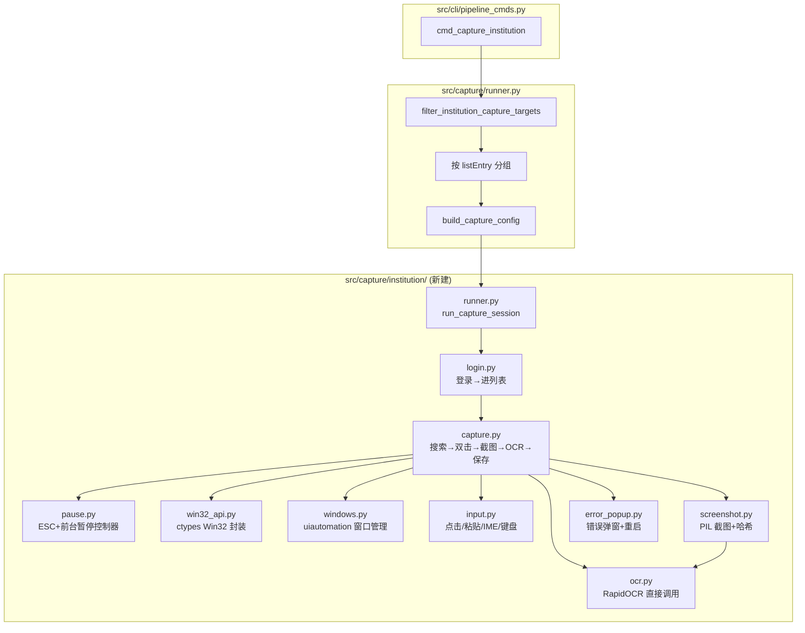

# Python 采图脚本重写计划

## 目标

将 `automation/ps1/capture-doctor-details.ps1` 的 `LoginAndSearchNames` 模式（机构端详情采图核心流程）用 Python 重写，解决三个根本问题：

1. ESC 暂停在 subprocess 下失效（`[Console]::KeyAvailable` 重定向异常吞掉所有暂停逻辑）
2. 切后台不暂停（同根因）
3. 杀 Python 后 PS1 孤儿进程继续跑（subprocess 独立进程，Windows 不自动杀子进程）

## 架构



## 依赖

新增 `pyproject.toml` optional-dependencies 组 `capture-institution`：

```toml
capture-institution = [
    "uiautomation>=2.0.0",    # UI Automation COM 封装（窗口查找/元素值读取/错误弹窗文本）
    "pyperclip>=1.8.0",       # 剪贴板操作
    "Pillow>=10.0.0",         # 截图（automation-ocr.txt 已装）
    "rapidocr-onnxruntime>=1.3.24",  # OCR（automation-ocr.txt 已装）
]
```

同时新建 `requirements/capture-institution.txt`。

安装：`pip install -e ".[capture-institution]"`（大部分依赖已在 .venv 中）。

**不引入** `pyautogui`、`pywinauto`——鼠标用 `ctypes` 直调 `mouse_event`（与 PS1 完全一致），键盘用 `ctypes` + `SendInput`，避免额外依赖和 failsafe 干扰。

## 模块设计

### `src/capture/institution/win32_api.py`

ctypes 封装，镜像 PS1 `NativeWin32` 类的 API 集：

```python
import ctypes
from ctypes import wintypes

user32 = ctypes.windll.user32
imm32 = ctypes.windll.imm32

# 常量
VK_ESCAPE = 0x1B
VK_CONTROL = 0x11
VK_SPACE = 0x20
SW_RESTORE = 5
SW_MAXIMIZE = 3
SWP_NOMOVE = 0x0002
SWP_NOSIZE = 0x0001
SWP_NOACTIVATE = 0x0010
HWND_TOPMOST = -1
HWND_NOTOPMOST = -2
MOUSEEVENTF_LEFTDOWN = 0x0002
MOUSEEVENTF_LEFTUP = 0x0004
WM_IME_CONTROL = 0x0283
IMC_SETOPENSTATUS = 0x0006

# 函数封装
def set_cursor_pos(x, y): ...
def mouse_event(flags, dx=0, dy=0, data=0): ...
def get_foreground_window() -> int: ...
def set_foreground_window(hwnd) -> bool: ...
def show_window(hwnd, cmd) -> bool: ...
def is_zoomed(hwnd) -> bool: ...
def set_window_pos(hwnd, after, x, y, cx, cy, flags): ...
def get_async_key_state(vkey) -> int: ...
def get_window_thread_process_id(hwnd) -> tuple[int, int]: ...
def get_window_text(hwnd) -> str: ...
def send_message(hwnd, msg, wparam, lparam): ...
def imm_get_default_ime_wnd(hwnd) -> int: ...
```

### `src/capture/institution/windows.py`

用 `uiautomation` 库做窗口查找，`win32_api` 做前台/最大化：

```python
import uiautomation as ua

def find_main_window(title_regex: str) -> ua.WindowControl | None:
    """遍历顶层窗口，正则匹配标题。镜像 PS1 Find-MainApplicationWindow。"""

def find_window_by_title(title_regex: str) -> ua.WindowControl | None:
    """通用窗口查找。"""

def wait_window_by_title(title_regex: str, timeout_s: int) -> ua.WindowControl | None:
    """轮询等待窗口出现。"""

def wait_detail_window(before_handles: set, main_hwnd: int, title_regex: str, timeout_s: int):
    """等待详情窗口（新句柄或标题匹配），排除主窗。"""

def bring_to_front(window) -> None:
    """ShowWindow(SW_RESTORE) → SetWindowPos TOPMOST/NOTOPMOST → SetForegroundWindow。"""

def maximize_window(window) -> None:
    """ShowWindow(SW_MAXIMIZE) → SetForegroundWindow。"""

def ensure_main_window_maximized(title_regex: str) -> None:
    """主窗口未最大化则先最大化再置前。"""

def get_window_handles() -> set[int]:
    """当前所有顶层窗口句柄集合。"""

def get_focused_element_value() -> str | None:
    """读焦点控件 Value（用于姓名框回读校验）。"""

def get_top_level_titles() -> list[str]:
    """EnumWindows 枚举标题（检测 owned 验证码窗等）。"""
```

### `src/capture/institution/input.py`

```python
def screen_click(x, y, focus_window=None, pause_ctrl=None):
    """wait_if_pause → bring_to_front → SetCursorPos → mouse_event down/up。"""

def screen_double_click(x, y, focus_window=None, pause_ctrl=None):
    """两次 click，间隔 60ms。镜像 PS1 Invoke-ScreenDoubleClick。"""

def click_and_paste_text(x, y, text, focus_window=None, pause_ctrl=None):
    """点击 → 关IME → Ctrl+A → Del → 剪贴板 → Ctrl+V → 回读校验。"""

def set_ime_english_for_foreground():
    """GetForegroundWindow → ImmGetDefaultIMEWnd → SendMessage(WM_IME_CONTROL, IMC_SETOPENSTATUS, 0)。"""

def close_window_alt_f4(window):
    """BringToFront → SendInput Alt+F4。"""

def send_key_combo(*keys):
    """ctypes SendInput 发送 Ctrl+A / Ctrl+V / Delete 等组合键。"""

def move_cursor_away(main_window):
    """移鼠标到列表左下空白，避免悬停提示。"""
```

`send_key_combo` 用 `ctypes` + `SendInput`（`KEYBDINPUT`），不依赖 `System.Windows.Forms.SendKeys`。每个组合键的 down/up 时序与 PS1 `SendKeys::SendWait` 等价。

### `src/capture/institution/screenshot.py`

```python
from PIL import ImageGrab, Image
import hashlib

def capture_window_bitmap(window) -> Image.Image:
    """bring_to_front → 读 BoundingRectangle → ImageGrab.grab(bbox)。"""

def capture_window_png(window, path: str):
    """截图并保存 PNG。"""

def get_bitmap_hash(image: Image.Image) -> str:
    """PNG 字节 SHA256（去重用）。"""

def get_screen_rect_hash(left, top, width, height) -> str:
    """区域截图哈希（稳定检测用）。"""
```

### `src/capture/institution/ocr.py`

**直接导入 `RapidOCR`，不走子进程**——这是 Python 重写的核心优势：

```python
from rapidocr_onnxruntime import RapidOCR
import re

_engine = None

def get_engine() -> RapidOCR:
    global _engine
    if _engine is None:
        _engine = RapidOCR()
    return _engine

def recognize_image(image: Image.Image) -> str:
    """PIL Image → 临时 PNG → RapidOCR → 多行文本拼接。"""
    # 或直接传 numpy array 给 engine

def get_cert_code_from_text(text: str) -> str | None:
    """正则匹配「执业证书编码」/「证书编码」。镜像 PS1 Get-CertCodeFromOcrText。"""

def get_detail_fields_from_text(text: str) -> dict:
    """提取姓名+证书编号。"""

def test_loading_text(text: str) -> bool:
    """检测「正在查询/请稍后」等加载文案。"""
```

**不再需要** `recognize_detail.py` 的 `--serve` 子进程、stdin/stdout 管道、JSON 协议、`Start-DetailOcrServer`/`Stop-DetailOcrServer`。OCR 变成普通函数调用，自然支持暂停（调用期间主线程阻塞但暂停检查在调用前的 `wait_if_pause_requested` 已执行；OCR 本身 ~1-2 秒，比子进程模式快很多因为省了 IPC 开销）。

### `src/capture/institution/pause.py`

**核心优势**：全部用 `ctypes` + `GetAsyncKeyState` + `GetForegroundWindow`，不依赖控制台，subprocess 下也能工作：

```python
import time
from . import win32_api

class PauseController:
    def __init__(self, doctor_app_process_ids: set[int], pause_when_not_foreground: bool = True):
        self.is_paused = False
        self.is_foreground_paused = False
        self.pause_when_not_foreground = pause_when_not_foreground
        self._doctor_app_pids = doctor_app_process_ids
        self._escape_was_down = False

    def _check_esc_edge(self) -> bool:
        """GetAsyncKeyState(VK_ESCAPE) 边沿检测。不依赖控制台。"""
        state = win32_api.get_async_key_state(win32_api.VK_ESCAPE)
        down = (state & 0x8000) != 0
        if down and not self._escape_was_down:
            self._escape_was_down = True
            return True
        if not down:
            self._escape_was_down = False
        return False

    def _is_doctor_app_in_foreground(self) -> bool:
        """GetForegroundWindow → 检查 PID 是否属于机构端。"""
        hwnd = win32_api.get_foreground_window()
        if hwnd == 0:
            return False
        _, pid = win32_api.get_window_thread_process_id(hwnd)
        return pid in self._doctor_app_pids

    def _update_foreground_pause(self):
        """不在前台 → 设 is_foreground_paused。在前台不清除（需按 ESC 恢复）。"""
        if not self.pause_when_not_foreground:
            return
        if not self._is_doctor_app_in_foreground():
            if not self.is_foreground_paused:
                self.is_foreground_paused = True
                print("[暂停] 机构端不在前台，切回前台后按 ESC 继续。")

    def wait_if_pause_requested(self):
        """主入口：检查 ESC → 切换暂停/恢复 → 检查前台 → 暂停则循环等待。"""
        toggle = self._check_esc_edge()
        if toggle:
            self._handle_toggle()
        self._update_foreground_pause()
        if not self.is_paused and not self.is_foreground_paused:
            return
        # 暂停循环
        while self.is_paused or self.is_foreground_paused:
            time.sleep(0.15)
            if self._check_esc_edge():
                self._handle_toggle()
            self._update_foreground_pause()

    def _handle_toggle(self):
        """ESC 按下时的暂停/恢复逻辑。"""
        if self._is_doctor_app_in_foreground():
            if self.is_paused or self.is_foreground_paused:
                # 恢复
                self.is_paused = False
                self.is_foreground_paused = False
                print("[恢复] 已恢复运行。")
            else:
                # 暂停
                self.is_paused = True
                print("[暂停] 已暂停，在机构端窗口前台再按 ESC 恢复。")
        else:
            if not (self.is_paused or self.is_foreground_paused):
                self.is_paused = True
                print("[暂停] 已暂停，切回机构端窗口前台后按 ESC 恢复。")
            else:
                print("[提示] 机构端不在前台，请先切回机构端窗口，再按 ESC 恢复。")

    def sleep_with_pause(self, seconds: float):
        """可中断睡眠，每 150ms 检查暂停。"""
        deadline = time.time() + seconds
        while time.time() < deadline:
            self.wait_if_pause_requested()
            remaining = deadline - time.time()
            if remaining <= 0:
                break
            time.sleep(min(0.15, remaining))
```

### `src/capture/institution/login.py`

```python
def resolve_doctor_app_path(config: dict) -> str:
    """config.appPath → 运行中进程 → 快捷方式搜索。镜像 PS1 Resolve-DoctorAppPath。"""

def start_doctor_application(app_path: str):
    """subprocess.Popen 启动机构端。"""

def get_doctor_app_pids(app_path: str) -> set[int]:
    """枚举机构端相关进程 PID（供 PauseController 用）。"""

def login_to_home(config: dict, pause_ctrl: PauseController) -> WindowControl:
    """
    完整登录流程：
    1. 启动应用
    2. 等登录窗口
    3. 点击「切换登录方式」(loginCalibration.SwitchLoginX/Y)
    4. 等画面稳定
    5. 输入账号 (loginCalibration.UserX/Y)
    6. 输入密码 (loginCalibration.PasswordX/Y)
    7. 点击登录 (loginCalibration.LoginButtonX/Y)
    8. 等主页加载（标题不含「用户登录」，宽高 >800x500）
    9. 最大化 + 等稳定
    返回主窗口。
    """

def enter_list_from_home(main_window, list_entry: str, config: dict, pause_ctrl: PauseController):
    """
    从主页进入列表：
    1. bring_to_front + maximize
    2. 点击主/多执业入口坐标
    3. 等列表稳定（画面哈希连续帧一致）
    """
```

### `src/capture/institution/capture.py`

核心采图循环，镜像 PS1 `Capture-NameSeries`：

```python
def capture_name_series(
    main_window, persons: list[dict], config: dict,
    list_entry: str, output_dir: Path, pause_ctrl: PauseController,
    ocr_engine, error_handler
) -> CaptureResult:
    """
    按姓名分组循环：
    for each name_group:
        1. 搜索姓名（click_and_paste_text 到搜索框）
        2. 等搜索结果加载
        3. for row in range(max_rows):
            a. 计算 y = first_row_y + row * row_height
            b. 记录当前窗口句柄集
            c. screen_double_click(x, y) 打开详情
            d. wait_detail_window 等详情窗
            e. 找不到详情窗 → find_error_popup → 设 need_restart
            f. wait_detail_content_ready（画面稳定 + OCR 有证书号）
            g. 去重（与上行哈希相同 → 空行结束）
            h. OCR 提取证书号 → 匹配 persons 中的待抓取人
            i. 匹配 → 保存 {name}_{certCode}.png
            j. 不匹配 → 跳过该行
            k. close_window_alt_f4 关详情窗
            l. bring_to_front 回主列表
        4. 全部 remaining 匹配完或无更多行 → 下一个姓名
    """

def invoke_capture_with_recovery(persons, config, list_entry, output_dir, ...):
    """带错误弹窗自动重启的包装循环。镜像 PS1 Invoke-CaptureNameSeriesWithRecovery。"""
    for attempt in range(max_restarts):
        result = capture_name_series(...)
        if not result.need_restart:
            break
        restart_doctor_and_enter_list(config, list_entry, pause_ctrl)
```

### `src/capture/institution/error_popup.py`

```python
def find_error_popup(text_regex: str, title_regex: str) -> str | None:
    """遍历顶层窗口，匹配错误弹窗文案/标题，返回弹窗文本。"""

def write_error_popup_log(path, context, popup_text, count, captured_since_last):
    """追加 CSV 日志。"""

def stop_doctor_application(app_path: str):
    """按进程名 kill 机构端进程。"""

def restart_doctor_and_enter_list(config, list_entry, pause_ctrl):
    """stop → wait → login_to_home → enter_list_from_home。"""
```

### `src/capture/institution/runner.py`

编排器，替代 PS1 调用：

```python
def run_capture_session(
    persons: list[dict[str, str]],  # [{"name": ..., "certCode": ...}]
    list_entry: str,                 # "Main" | "Multi"
    config: dict,                    # 完整 config.json 数据
    output_dir: Path,
    *,
    dry_run: bool = False,
) -> int:
    """
    1. 解析 app_path、login_calib、list_calib
    2. 获取 doctor_app_pids → 创建 PauseController
    3. 初始化 OCR engine（直接 RapidOCR()，无子进程）
    4. login_to_home → enter_list_from_home
    5. invoke_capture_with_recovery
    6. 返回 exit_code
    """
```

## CLI 集成改动

### `src/capture/runner.py` — `run_institution_capture`

改为调用 Python `run_capture_session` 而非 `run_task`：

```python
# 原来：
task = AutomationTask(ps1_mode="LoginAndSearchNames", list_entry=list_entry)
code = run_task(task, extra)

# 改为：
from src.capture.institution.runner import run_capture_session
config = load_json(config_path)  # 读临时 config 或 config.json
code = run_capture_session(
    persons=persons,
    list_entry=list_entry,
    config=config,
    output_dir=captures / institution_list_folder(list_entry),
    dry_run=dry_run,
)
```

**保留** `build_capture_config` 和临时 config 文件——`run-automation` CLI 命令仍需要。`run_capture_session` 接收已解析的 config dict，不直接依赖临时文件。

### `src/cli/automation.py` — `run_task`

`capture` task 改为走 Python 路径。`calibrate`、`export` 暂标记不可用（Phase 2/3 再迁）。PS1 验证通过后删除。

## 包含 vs 延后

| 功能 | Phase 1（本次） | 延后 |
|------|:---:|:---:|
| 登录 → 进列表 → 搜索 → 截图 → OCR → 保存 | ✓ | |
| ESC 暂停/恢复 + 前台检测 | ✓ | |
| 错误弹窗检测 + 自动重启 | ✓ | |
| 已有截图跳过 | ✓ | |
| 坐标校准（CalibrateAll） | | ✓ |
| 导出流程（Export） | | ✓ |
| 旧 Batch/Prototype 模式 | | ✓ |
| Ctrl+空格 全局热键 | | ✓（ESC 已够用） |
| 验证码 OCR（导出用） | | ✓ |

## 实现步骤

1. **建包结构** `src/capture/institution/` + `__init__.py`
2. **win32_api.py** — ctypes 封装所有 Win32 API
3. **windows.py** — uiautomation 窗口查找 + win32 前台/最大化
4. **input.py** — 点击/双击/粘贴/IME/键盘/Alt+F4
5. **screenshot.py** — PIL 截图 + 哈希
6. **ocr.py** — RapidOCR 直接调用 + 证书号提取
7. **pause.py** — PauseController（ESC + 前台）
8. **error_popup.py** — 错误弹窗 + 重启
9. **login.py** — 登录 + 进列表
10. **capture.py** — 核心采图循环
11. **runner.py** — 编排器
12. **改 `src/capture/runner.py`** — 调用 Python 替代 PS1
13. **改 `pyproject.toml`** — 加 `capture-institution` 依赖组
14. **建 `requirements/capture-institution.txt`**
15. **测试** — `capture-institution --dry-run` → 小批量实跑验证

## 关键设计决策

1. **OCR 直接调用**：不再走子进程 stdin/stdout，直接 `from rapidocr_onnxruntime import RapidOCR`。省去 IPC 开销、JSON 协议、进程管理。模型只在首次调用时加载（~2 秒），之后每次 ~1 秒。

2. **鼠标用 ctypes**：直调 `mouse_event`，与 PS1 完全一致的 down/up 时序和双击间隔。不用 `pyautogui`（有 failsafe 干扰）。

3. **键盘用 ctypes + SendInput**：封装 `send_key_combo('ctrl', 'a')` 等组合键。不用 `System.Windows.Forms.SendKeys`（.NET 依赖）。

4. **窗口查找用 uiautomation 库**：Python 原生 UI Automation COM 封装，替代 PS1 的 `System.Windows.Automation`。仅用于只读操作（找窗口、读元素值、读弹窗文本），不做 SetValue/Invoke（PS1 验证过 UIA provider 不稳定）。

5. **PS1 文件移除**：Python 重写验证通过后删除 `capture-doctor-details.ps1`，不做 fallback。`run-automation` 的 `capture`/`calibrate`/`export` 子命令中，`capture` 走 Python，`calibrate`/`export` 暂不可用（Phase 2/3 再迁）。

6. **config 读取不变**：仍从 `config.json` 读 `loginCalibration`/`listCalibration`/`loginUser`/`loginPassword`/`appPath`。临时 config 机制保留。
